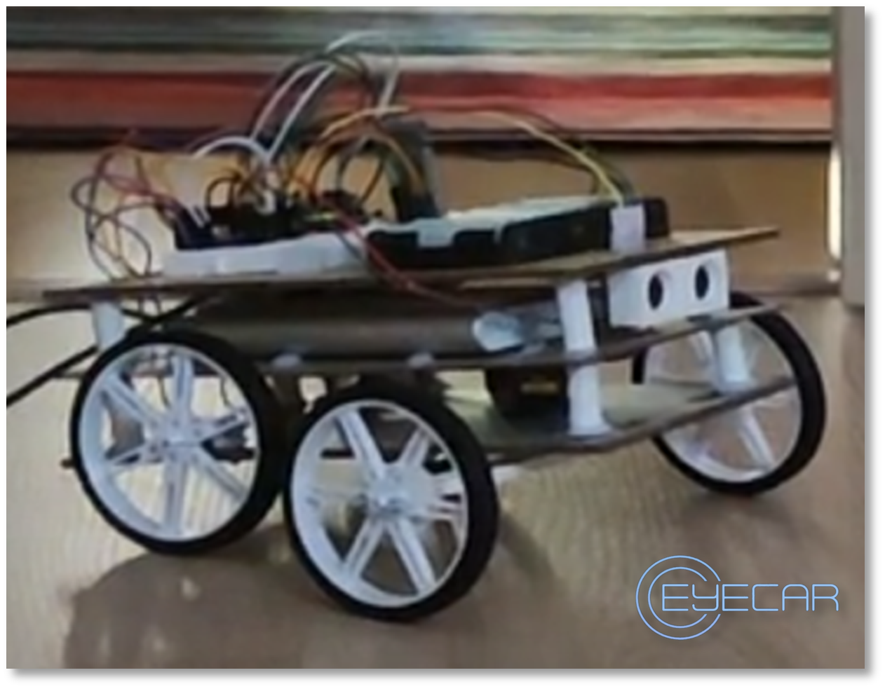
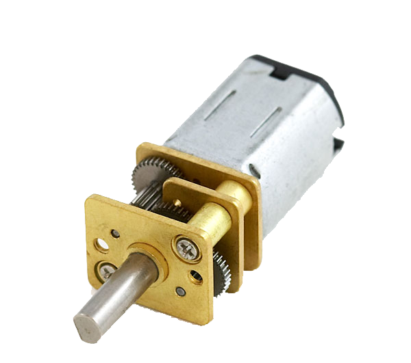
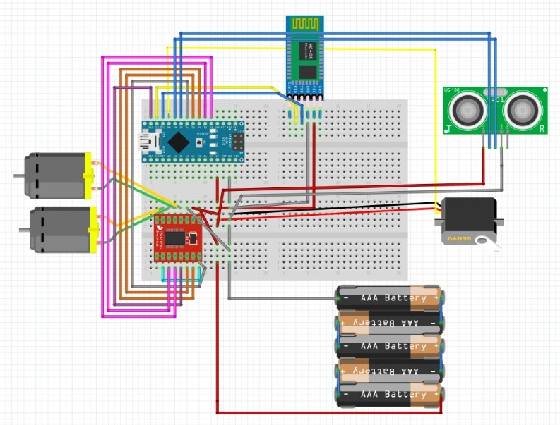
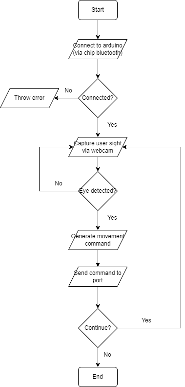

# eyeCar
Project developed for evaluation purposes. 

## Demo
https://youtu.be/9e5DXK_3BVU

## Table of Contents
- [What is this?](#what-is-this)
- [Requirements](#requirements)
- [How to use](#how-to-use)
- [Components](#components)
- [Hardware Scheme](#hardware-scheme)
- [Design software employed](#design-software-employed)
- [Software Architecture](#software-architecture)
- [3D designs](#3d-designs)
- [Contributions](#contributions)
- [Authors](#authors)

## What is this?
This idea of this project is to create a car which can be controlled by the eye of the user. For the safety of the owner it automatically detect obstacles and dangerous environment, acting in response.
Our main goal for this project was to make a system that could ease the use of sanitary wheelchair, making them more autonomous.

## Requirements
- For running the code these are the required languages and libraries:
    * [C (Arduino IDE 2.1.0)](https://docs.arduino.cc/)
        * [servo](https://docs.arduino.cc/tutorials/generic/basic-servo-control)
    * [Python 3.10.x](https://www.python.org/)
        * [numpy](https://numpy.org/doc/)
        * [cmake](https://cmake.org/documentation/)
        * [pySerial](https://pyserial.readthedocs.io/en/latest/)
        * [time](https://docs.python.org/3/library/time.html)
        * [math](https://docs.python.org/3/library/math.html)
        * [dlib](http://dlib.net/python/index.html)
        
## How to use
Currently it is working in basic standards, we made the movement possible through detecting the eye gaze and determine the direction wanted: 
- Right / left: turn
- Front: stay in motion
- Up: start motion
- Close: stop

## Components
  

- Arduino Nano
    - Specs:
        - Weight: 7g
        - PCB size: 18 x 45 mm
        - Arquitecture: AVR
        - Power: 5V
        - Flash Memory: 32 KB
        - SRAM: 2KB
        - Clock speed: 16 MHz
        - Analog IN Pins: 8
        - EEPROM: 1 KB
        - DC Current per I/O Pins: 40 mA (I/O Pins)
        - Input Voltage: 7-12V
        - Digital I/O Pins: 22 (6 of which are PWM)
        - PWM Output: 6
        - Power Consumption: 19 mA

  
- HC-SR04 (Ultrasonic sensors)
    - Specs:
        - Weight: 8.5g
        - Dimension: 45mm x 20mm x 15mm
        - Power Supply: +5V DC
        - Quiescent Current : < 2mA
        - Working Current: 15mA
        - Effectual Angle: < 15°
        - Ranging Distance : 2cm – 400 cm/1″ – 13ft
        - Resolution : 0.3 cm
        - Measuring Angle: 30 degree
        - Trigger Input Pulse width: 10uS TTL pulse
        - Echo Output Signal: TTL pulse proportional to the distance range

- Micro servomotor SG90
    - Specs:
        - Weight: 9g
        - Size: 22.2 x 11.8 x 31 mm
        - Torque: 1.8 kg/cm
        - Speed: 0.1s/60 degrees
        - Power: ~5V
        - Working temperature: 0 ºC - 55 ºC

 

- Motor controller Driver 1a Dual TB6612FNG
    - Specs:
        - Dimensions: 0.8 x 0.8 mm
        - Power supply voltage: VM = 15V max, VCC = 2.7-5.5V
        - Output current: Iout = 1.2A (average) / 3.2A (peak)
        - Standby control to save power
        - CW/CCW/short brake/stop motor control modes
        - Built-in thermal shutdown circuit and low voltage detecting circuit
        - All pins of the TB6612FNG broken out to 0.1" spaced pins
        - Filtering capacitors on both supply lines

 

- Bluetooth module HC-05

 

- x2 Micro motor LP with gear reducer 10:1
- Protoboard
- x2 pair of wheels
- Battery Poweradd Pilot 2GS 10000mAh
- Battery holder x6 AA

## Hardware scheme

## Design software employed 
* [Blender 3.5](https://www.blender.org/)
* [UltiMaker Cura 5.3.1](https://ultimaker.com/software/ultimaker-cura/)
* [PrusaSlicer 2.5.2](https://www.prusa3d.com/es/pagina/prusaslicer_424/)

## Software Architecture

## 3D designs
- Ultrasonic sensor cover 

  

- Wheel bolt bracket

  

- Micromotor bracket

  

- Layer support

  

- Front wheels axis

  

- Layer 1 and 2 - Power supplies and microelectronics

  

- Layer 3 - Wheel support

  

## Contributions
Our project aims to provide and contribute to people with reduced mobility and added disabilities to ease their use of wheelchairs or other mobility devices.

We intend to achieve this goal through a comfortable use and a low difficulty curve, through "eye-tracking", since it will adapt to the directions desired by the user without least effort.

This project works testing the aforementioned features using a miniature car model as a prototype, of course with safety in mind, being able to detect obstacles in both directions of traffic, to avoid any type of accident that could affect the user directly.

Taking all these points into account, we can affirm that our project has a large component related to the computer vision field, this being its incentive, although the structuring and designing part of the car must also be included, where we emphasized above all on speed control, user negligence probability and other factors.

We truly believe that our project has excellent potential and a goal of contributing our grain of sand to a needy and important part of society.

## Authors
* Pau Bermúdez Valle - 1604190 - <a href="https://github.com/SrKoko">SrKoko</a>  
* Sergio Barranco Aguilar - 1606048 - <a href="https://github.com/Egoris78">Egoris78</a>  
* Samya Karzazi el Bachiri - 1568589 - <a href="https://github.com/imsamkb13">imsamkb13</a>  
* José Francisco Aguilera Oliver - 1601361 - <a href="https://github.com/kaitouser">kaitouser</a>  

